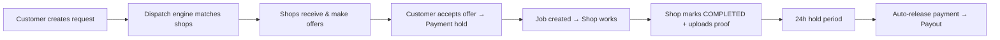
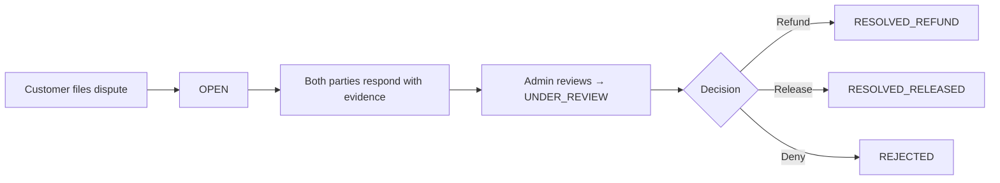
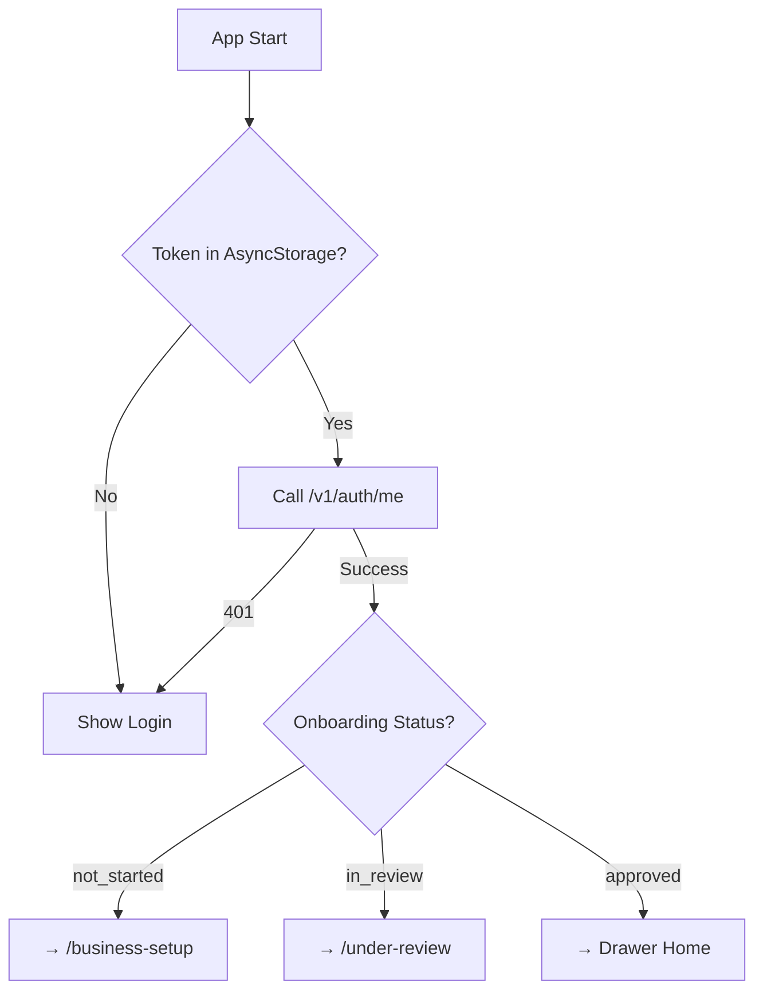
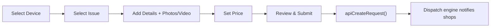
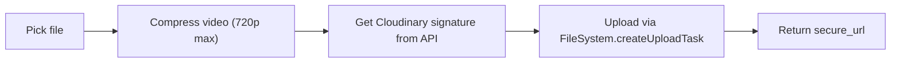

# RepairRebel Platform — Complete Architecture Walkthrough

> [!NOTE]
> This document is a comprehensive map of the entire RepairRebel ecosystem: **Server**, **Store App**, and **Customer App**. It is the canonical reference for understanding how the platform works end-to-end.

---

## 1. Server Architecture

### 1.1 Tech Stack
| Layer | Technology |
|---|---|
| Framework | **Fastify v5** with TypeScript |
| ORM | **Drizzle ORM** → PostgreSQL |
| Cache / Queues | **Redis** → BullMQ, rate-limiting, session cache |
| Real-time | **Socket.IO** (presence, chat, status events) |
| Payments | **Stripe Connect** (payment intents, payouts, subscriptions) |
| Media | **Cloudinary** (signed uploads for images/video) |
| Push | **Expo Push Notifications** |
| Email | **Nodemailer** (handlebars templates) |
| Auth | **JWT** (access + rotating refresh tokens), **Argon2id** hashing |

### 1.2 Project Structure
```
server/src/
├── db/              # Drizzle schema + migrations
│   └── schema/      # Table definitions (20+ tables)
├── modules/         # Feature modules (routes → controller → service)
│   ├── auth/        # Signup, login, token refresh, password change
│   ├── admin/       # Admin dashboard, onboarding approval, user management
│   ├── chat/        # Real-time messaging (text, image, video)
│   ├── customer/    # Customer-specific endpoints (requests, jobs, addresses)
│   ├── device-model/ # Device catalog (brands, models, search)
│   ├── dispatch/    # Request→shop matching & routing engine
│   ├── dispute/     # Dispute lifecycle (create, respond, resolve)
│   ├── inventory/   # Shop parts inventory (CRUD, stock movements)
│   ├── jobs/        # Job lifecycle (status transitions, proof, media)
│   ├── media/       # Cloudinary signature generation
│   ├── notifications/ # Push token management + in-app notifications
│   ├── onboarding/  # Shop onboarding (submit docs → review → approve)
│   ├── offers/      # Shop→customer offer creation
│   ├── protection/  # Protection plans, subscriptions, claims
│   ├── requests/    # Repair request CRUD
│   ├── reviews/     # Review submission, replies, reporting
│   ├── shops/       # Shop profile, settings, earnings, payouts
│   └── stripe/      # Stripe Connect onboarding + webhooks
├── plugins/         # Fastify plugins (auth, CORS, rate-limit, socket)
├── services/        # Shared services (email, stripe, cloudinary)
├── utils/           # Helpers (crypto, validation, formatting)
└── index.ts         # Server entry point
```

### 1.3 Database Schema (Key Tables)
```
users, shops, device_models, issue_types, repair_requests,
repair_offers, dispatch_queue, jobs, job_status_history, job_media,
chat_messages, reviews, review_replies, disputes, dispute_messages,
notifications, push_tokens, addresses, inventory_items, 
inventory_movements, protection_plans, protection_subscriptions,
protection_claims, stripe_webhook_events
```

### 1.4 API Security
- **Request Signing**: All authenticated requests include `x-rr-ts`, `x-rr-nonce`, `x-rr-signature` headers (HMAC-like signature over method + path + timestamp + nonce + body)
- **JWT Rotation**: Access tokens expire in 15 minutes; refresh tokens are single-use and rotated on each refresh
- **Idempotency**: Mutation endpoints support `Idempotency-Key` header to prevent duplicate operations
- **Rate Limiting**: Redis-backed rate limiter on sensitive endpoints (auth, token refresh)

### 1.5 Key Business Workflows

#### Repair Lifecycle


#### Dispute Flow


---

## 2. Store App Architecture

### 2.1 Tech Stack
| Layer | Technology |
|---|---|
| Framework | **Expo** (managed workflow) + **React Native** |
| Navigation | **expo-router** with **Drawer** layout (via `@react-navigation/drawer`) |
| State | **React Query** (server state) + **React Context** (auth) |
| Icons | **lucide-react-native** |
| Media | **react-native-compressor** (video compression) + Cloudinary upload |

### 2.2 Design System
- **Theme**: Dark mode (`#0B0B0D` background, `#F5F5F7` text)
- **Primary Color**: `#FF3B30` (iOS system red)
- **Accent**: `#30D158` (iOS system green)
- **Platform-aware**: Uses `rgba()` surfaces on iOS for blur effects, solid colors on Android
- **Navigation**: Side drawer with shop info header, live/offline status badge

### 2.3 App Structure
```
store/
├── app/
│   ├── _layout.tsx              # Root: QueryClient + Auth + Notification providers
│   ├── (auth)/                  # Login/signup screens
│   ├── (tabs)/                  # Drawer layout with 9 screens:
│   │   ├── index.tsx            #   Home dashboard
│   │   ├── (requests)/          #   Repair requests (LIVE/HISTORY tabs)
│   │   ├── jobs.tsx             #   Active & completed jobs
│   │   ├── inventory.tsx        #   Parts inventory management
│   │   ├── earnings.tsx         #   Revenue chart + payouts
│   │   ├── disputes.tsx         #   Dispute management
│   │   ├── reviews.tsx          #   Customer reviews + replies
│   │   ├── protection.tsx       #   Protection plan admin
│   │   └── settings.tsx         #   Shop settings
│   ├── business-setup.tsx       # Onboarding wizard (blocked navigation)
│   ├── under-review.tsx         # Pending approval screen
│   ├── request-details.tsx      # Single request view
│   ├── make-offer.tsx           # Create offer modal
│   ├── job-details.tsx          # Job detail with timeline
│   ├── upload-video.tsx         # Video proof upload
│   ├── chat-list.tsx            # Chat threads list
│   ├── chat-thread.tsx          # Individual chat
│   ├── dispute-detail.tsx       # Dispute conversation
│   └── notifications.tsx        # Notification center
├── services/                    # API layer
├── contexts/                    # AuthContext, NotificationContext
├── components/                  # Reusable UI components
├── constants/                   # Colors, navigation config
└── types/                       # TypeScript interfaces
```

### 2.4 Service Layer (10 modules)

| Service | Endpoints | Purpose |
|---|---|---|
| [api.ts](file:///home/adnan/Desktop/Project/RepairRebel/store/services/api.ts) | Core | `apiFetch` / `apiFetchPaginated` with JWT refresh + HMAC signing |
| [auth.ts](file:///home/adnan/Desktop/Project/RepairRebel/store/services/auth.ts) | 4 | Signup, login, logout, session restore |
| [requests.ts](file:///home/adnan/Desktop/Project/RepairRebel/store/services/requests.ts) | 4 | Shop requests list, detail, mark seen, create offer |
| [jobs.ts](file:///home/adnan/Desktop/Project/RepairRebel/store/services/jobs.ts) | 5 | Jobs list, detail, status update, accept/decline dispatch |
| [earnings.ts](file:///home/adnan/Desktop/Project/RepairRebel/store/services/earnings.ts) | 4 | Earnings summary, payouts list, cashout, refresh |
| [inventory.ts](file:///home/adnan/Desktop/Project/RepairRebel/store/services/inventory.ts) | 10 | Full CRUD + stock in/out/adjust, pricing, device model search |
| [chat.ts](file:///home/adnan/Desktop/Project/RepairRebel/store/services/chat.ts) | 4 | Threads list, messages, send message, mark seen |
| [disputes.ts](file:///home/adnan/Desktop/Project/RepairRebel/store/services/disputes.ts) | 5 | Disputes list, detail, respond, evidence upload (Cloudinary) |
| [reviews.ts](file:///home/adnan/Desktop/Project/RepairRebel/store/services/reviews.ts) | 4 | Review summary, list, reply, report |
| [protection.ts](file:///home/adnan/Desktop/Project/RepairRebel/store/services/protection.ts) | 9 | Plans CRUD, subscribers, claims review, analytics |
| [settings.ts](file:///home/adnan/Desktop/Project/RepairRebel/store/services/settings.ts) | 9 | Profile, warranty, vacation, notifications, location, Stripe Connect, tax docs |
| [onboarding.ts](file:///home/adnan/Desktop/Project/RepairRebel/store/services/onboarding.ts) | 7 | Shop setup (profile, location, hours, service area), doc upload, submit |
| [media.ts](file:///home/adnan/Desktop/Project/RepairRebel/store/services/media.ts) | 4 | Video compression, Cloudinary signed upload, job media save/list |
| [notifications.ts](file:///home/adnan/Desktop/Project/RepairRebel/store/services/notifications.ts) | 2 | Push token register/unregister with retry logic |
| [socket.ts](file:///home/adnan/Desktop/Project/RepairRebel/store/services/socket.ts) | — | Socket.IO connection + room management (`join:shop`) |

### 2.5 Auth Flow


### 2.6 Socket Events (Store)
- **Rooms joined**: `shop:{shopId}` (on auth)
- **Heartbeat**: `presence:heartbeat` every 25s
- **Listened events**: `dispatch:new`, `dispatch:expired`, `job:*`, `chat:message`, `chat:seen`, `earnings:released`

---

## 3. Customer App Architecture

### 3.1 Tech Stack
| Layer | Technology |
|---|---|
| Framework | **Expo** (managed workflow) + **React Native** |
| Navigation | **expo-router** with **Tab** layout (6 tabs) |
| State | **React Query** (server state) + **React Context** (auth, repair draft) |
| Payment | **@stripe/stripe-react-native** (card collection, 3DS, SetupIntents) |
| Icons | **lucide-react-native** |
| Media | **react-native-compressor** + Cloudinary upload |

### 3.2 Design System
- **Theme**: Light mode (`#FFFFFF` background, `#0B0B0C` text)
- **Primary Color**: `#E70A05` (brand red)
- **Accent**: `#22C55E` (success green)
- **Tab bar**: White with subtle shadow, active indicator pill
- **Note**: `Colors.dark` is aliased to `Colors.light` for backwards compatibility

### 3.3 App Structure
```
Repairrebel Customer/
├── app/
│   ├── _layout.tsx              # Root: QueryClient + Auth + Repair + Notification providers
│   ├── (auth)/                  # Login/signup screens
│   ├── (tabs)/                  # Tab bar with 6 tabs:
│   │   ├── (home)/              #   Home dashboard
│   │   ├── requests.tsx         #   My repair requests
│   │   ├── map.tsx              #   Nearby shops map
│   │   ├── orders.tsx           #   Active/completed jobs
│   │   ├── messages.tsx         #   Chat threads (with badge)
│   │   └── profile.tsx          #   Account & settings
│   ├── select-device.tsx        # Repair flow: step 1
│   ├── select-issue.tsx         # Repair flow: step 2
│   ├── add-details.tsx          # Repair flow: step 3
│   ├── pricing.tsx              # Repair flow: step 4
│   ├── review-request.tsx       # Repair flow: step 5 (submit)
│   ├── request-detail.tsx       # Request detail + offers
│   ├── job-detail.tsx           # Job tracking + timeline
│   ├── chat.tsx                 # Chat with shop
│   ├── payment-methods.tsx      # Stripe card management
│   ├── saved-addresses.tsx      # Address book
│   ├── protection.tsx           # Protection plan browsing
│   ├── submit-claim.tsx         # File protection claim
│   ├── my-disputes.tsx          # Disputes list
│   ├── dispute-detail.tsx       # Dispute conversation
│   ├── leave-review.tsx         # Post-job review
│   ├── edit-profile.tsx         # Profile editor
│   ├── change-password.tsx      # Password change
│   ├── change-email.tsx         # Email change
│   ├── notifications-settings.tsx
│   ├── privacy-policy.tsx
│   ├── terms-conditions.tsx
│   ├── help-support.tsx         # AI + live agent support
│   ├── report-issue.tsx
│   ├── my-reviews.tsx
│   └── notifications.tsx
├── services/                    # API layer
├── context/                     # AuthContext, RepairContext, NotificationContext
├── components/                  # Reusable UI
├── constants/                   # Colors, theme
└── types/                       # TypeScript interfaces
```

### 3.4 Service Layer (12 modules)

| Service | Endpoints | Purpose |
|---|---|---|
| [api.ts](file:///home/adnan/Desktop/Project/RepairRebel/Repairrebel%20Customer/services/api.ts) | Core | `apiFetch` with JWT refresh + HMAC signing |
| [auth.ts](file:///home/adnan/Desktop/Project/RepairRebel/Repairrebel%20Customer/services/auth.ts) | 4 | Signup, login, logout, session restore |
| [requests.ts](file:///home/adnan/Desktop/Project/RepairRebel/Repairrebel%20Customer/services/requests.ts) | 13 | Device search, issue types, price estimate, create/list/detail request, accept/reject/confirm offer, list/detail jobs, confirm job |
| [chat.ts](file:///home/adnan/Desktop/Project/RepairRebel/Repairrebel%20Customer/services/chat.ts) | 5 | Threads, messages, send, mark seen, media signature |
| [disputes.ts](file:///home/adnan/Desktop/Project/RepairRebel/Repairrebel%20Customer/services/disputes.ts) | 7 | Create dispute, list, detail, respond, evidence upload, video upload |
| [protection.ts](file:///home/adnan/Desktop/Project/RepairRebel/Repairrebel%20Customer/services/protection.ts) | 7 | Browse plans, subscribe, confirm payment, list subs, toggle autopay, cancel, submit claim |
| [payment-methods.ts](file:///home/adnan/Desktop/Project/RepairRebel/Repairrebel%20Customer/services/payment-methods.ts) | 6 | List cards, setup intent, confirm, confirm with token, delete, set default |
| [reviews.ts](file:///home/adnan/Desktop/Project/RepairRebel/Repairrebel%20Customer/services/reviews.ts) | 2 | Create review, list my reviews |
| [settings.ts](file:///home/adnan/Desktop/Project/RepairRebel/Repairrebel%20Customer/services/settings.ts) | 8 | Profile update, change password/email, stats, privacy, delete account, data export, notification prefs |
| [addresses.ts](file:///home/adnan/Desktop/Project/RepairRebel/Repairrebel%20Customer/services/addresses.ts) | 4 | CRUD for saved addresses |
| [support.ts](file:///home/adnan/Desktop/Project/RepairRebel/Repairrebel%20Customer/services/support.ts) | 6 | AI chatbot, conversation history, live agent connect, agent messaging |
| [media.ts](file:///home/adnan/Desktop/Project/RepairRebel/Repairrebel%20Customer/services/media.ts) | 2 | Video compression + Cloudinary upload (shared utility) |
| [notifications.ts](file:///home/adnan/Desktop/Project/RepairRebel/Repairrebel%20Customer/services/notifications.ts) | 2 | Push token register/unregister |
| [socket.ts](file:///home/adnan/Desktop/Project/RepairRebel/Repairrebel%20Customer/services/socket.ts) | — | Socket.IO + granular room management |

### 3.5 Repair Request Flow (RepairContext)


The `RepairContext` holds a `DraftRequest` object that is progressively filled across 5 wizard screens. On submit, it assembles a `CreateRequestInput` and calls the API.

### 3.6 Payment Integration (Stripe)
- **Card Management**: `SetupIntent` flow to save cards via `@stripe/stripe-react-native`
- **Payment Authorization**: When customer accepts an offer, a `PaymentIntent` is created with a hold
- **3D Secure**: `requiresAction` flag triggers on-session authentication
- **Deep Linking**: Root layout handles Stripe callback URLs via `Linking.addEventListener`

### 3.7 Socket Events (Customer)
- **Rooms joined**: `request:{id}`, `job:{id}`, `chat:{jobId}`, `support:{conversationId}`
- **Heartbeat**: `presence:heartbeat` every 25s
- **Listened events**: `offer:new`, `offer:expired`, `job:*`, `chat:message`, `chat:seen`, `support:*`

### 3.8 Chat Unread Badge System
The customer app has a sophisticated unread message tracking system:
1. `chatUnreadState.ts` — In-memory store with `forcedReadThreadIds` set
2. Tab layout subscribes to state changes and updates badge count
3. `markChatThreadRead()` → optimistically marks thread as read locally
4. `clearChatThreadReadOverride()` → clears override when new message from shop arrives
5. `getAdjustedUnreadTotal()` → computes badge number with overrides applied

---

## 4. Shared Patterns (Both Apps)

### 4.1 API Client (`apiFetch`)
Both apps use an identical pattern:
1. **Token Management**: Access token stored in memory, refresh token in `AsyncStorage`
2. **Auto-Refresh**: On 401, transparently refreshes token and retries the request
3. **Request Signing**: Every request includes:
   - `x-rr-ts` — Unix timestamp (seconds)
   - `x-rr-nonce` — 16-char random hex
   - `x-rr-signature` — HMAC-like hash of `method|path|timestamp|nonce|stableBody`
4. **Stable JSON**: Body is serialized with sorted keys for deterministic signature generation
5. **Error Handling**: Throws `ApiError` with `status`, `code`, `message` fields

### 4.2 Push Notifications
Both apps follow the same pattern:
1. Check permissions → request if needed
2. Get Expo push token (with 3 retries)
3. Set up Android notification channels (`default` + domain-specific)
4. Register token with server via `POST /v1/notifications/push-token` (with 3 retries)
5. On logout, unregister token via `DELETE /v1/notifications/push-token`

### 4.3 Notification Routing
Both apps use identical `buildNotificationRoute()` that maps push notification data to screen routes:
| `data.screen` | Route |
|---|---|
| `chat` / `chat-thread` | `/chat` or `/chat-thread` with `jobId` |
| `dispute-detail` | `/dispute-detail` with `id` or `jobId` |
| `job-detail` / `job-details` | `/job-detail` with `id` |
| `request-detail` / `request-details` | `/request-detail` with `id` + `dispatchId` |

### 4.4 Media Upload Pipeline


### 4.5 Contexts
| Context | Store | Customer |
|---|---|---|
| **AuthContext** | Auth state, onboarding status, shop name, vacation mode, protection flag, socket lifecycle | Auth state, user profile, socket lifecycle |
| **RepairContext** | — | Draft request state for multi-step wizard |
| **NotificationContext** | Toast notifications | Toast notifications |

---

## 5. Key Differences Reference

| Aspect | Store App | Customer App |
|---|---|---|
| **Theme** | Dark mode (#0B0B0D) | Light mode (#FFFFFF) |
| **Navigation** | Drawer (9 screens) | Tabs (6 tabs) |
| **Primary Color** | #FF3B30 (iOS red) | #E70A05 (brand red) |
| **Auth Guard** | Login → Onboarding check → Drawer | Login → Tabs |
| **Stripe** | Stripe Connect (payouts) | Stripe payments (card collection, 3DS) |
| **Chat Endpoint** | `/v1/chats/{jobId}` | `/v1/customer/chats/{jobId}` |
| **Socket Rooms** | `shop:{shopId}` | `request:{id}`, `job:{id}`, `chat:{jobId}` |
| **Unique Features** | Inventory, earnings/payouts, protection admin, onboarding wizard | Map view, address book, payment methods, AI support chat, protection browsing |
| **Provider Stack** | `QueryClient > Auth > Notification` | `QueryClient > Auth > Repair > Notification` |

---

## 6. Quick Reference: Endpoint Mapping

### Store → Server
| Store Service Call | Server Endpoint |
|---|---|
| `apiGetShopRequests()` | `GET /v1/shops/me/requests` |
| `apiGetRequestDetail()` | `GET /v1/requests/:id` |
| `apiCreateOffer()` | `POST /v1/requests/:id/offers` |
| `apiGetShopJobs()` | `GET /v1/shops/me/jobs` |
| `apiUpdateJobStatus()` | `PATCH /v1/jobs/:id/status` |
| `apiGetEarningsSummary()` | `GET /v1/shops/me/earnings/summary` |
| `apiCashout()` | `POST /v1/shops/me/cashout` |
| `apiGetShopProfile()` | `GET /v1/shops/me/profile` |
| `apiStartStripeConnect()` | `POST /v1/stripe/connect/start` |
| `apiGetPlans()` | `GET /v1/shops/me/protection/plans` |
| `apiReviewClaim()` | `POST /v1/protection/claims/:id/review` |

### Customer → Server
| Customer Service Call | Server Endpoint |
|---|---|
| `apiCreateRequest()` | `POST /v1/customer/requests` |
| `apiListRequests()` | `GET /v1/customer/requests` |
| `apiAcceptOffer()` | `POST /v1/customer/offers/:id/accept` |
| `apiConfirmJob()` | `POST /v1/customer/jobs/:id/confirm` |
| `apiListPaymentMethods()` | `GET /v1/customer/payment-methods` |
| `apiCreateSetupIntent()` | `POST /v1/customer/payment-methods/setup-intent` |
| `apiSubscribeToPlan()` | `POST /v1/customer/protection/subscribe` |
| `apiCreateDispute()` | `POST /v1/jobs/:id/disputes` |
| `apiChatWithAI()` | `POST /v1/customer/support/chat` |
| `apiConnectAgent()` | `POST /v1/customer/support/connect-agent` |
| `apiCreateReview()` | `POST /v1/customer/jobs/:id/review` |
